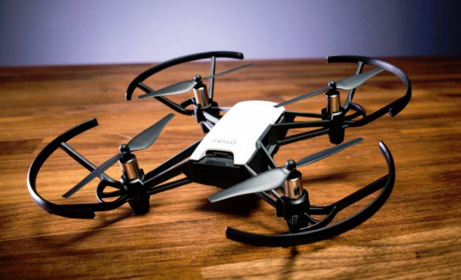

# backend-drone
Students will use python to control a `Tello` hobby drone, and fly around an obstacle course.  The drone can be purchased from the [DJI Store](https://store.dji.com/shop/tello-series)
for $99.00.  This particular drone is programmable in Python, with sample code in GitHub.

## Setup
- Future version will require building a h264 video decoder library.
- For now, just clone the repo and create your local virtual environment.

## Run the demo
1. Tello drone power on
2. Wait for wifi signal, then connect direct to TELLO-xxxxx wifi
3. Run the `tello_test.py` program
4. Drone will takeoff and fly a 1-meter triangle and then land

## References
[Tello-Python](https://github.com/dji-sdk/Tello-Python)
[Tello Pilots Forum](https://tellopilots.com/)

